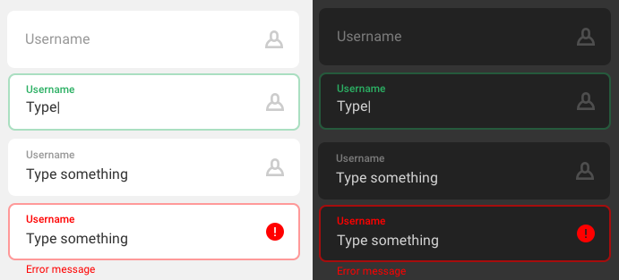

# TextInputLayout

**TextInputLayout** is a library that provides a modified `TextInputLayout`
from Google's [Material Components for Android](
https://github.com/material-components/material-components-android).
Namely, it provides a component that has an outlined `EditText` with
hint and error, but does not cut out the border.

**Please note** that only `TextInputLayout` and `TextInputEditText` are
supported.

## Preview



### Example usage

```XML
<cz.ackee.ui.textfield.TextInputLayout
    android:layout_width="match_parent"
    android:layout_height="wrap_content"
    android:layout_marginStart="16dp"
    android:layout_marginTop="16dp"
    android:layout_marginEnd="16dp"
    android:layout_marginBottom="16dp"
    android:hint="Username"
    app:boxBackgroundColor="@color/colorOnBackground"
    app:boxBackgroundMode="outline"
    app:boxCornerRadiusBottomEnd="8dp"
    app:boxCornerRadiusBottomStart="8dp"
    app:boxCornerRadiusTopEnd="8dp"
    app:boxCornerRadiusTopStart="8dp"
    app:boxStrokeColor="@color/input_stroke"
    app:boxStrokeWidth="0dp"
    app:boxStrokeWidthFocused="1dp"
    app:hintEnabled="true"
    app:hintPaddingTop="12dp"
    app:hintTextAppearance="@style/TextAppearance.Design.Hint">

    <cz.ackee.ui.textfield.TextInputEditText
        android:layout_width="match_parent"
        android:layout_height="wrap_content"
        android:background="@null"
        android:paddingStart="16dp"
        android:paddingTop="28dp"
        android:paddingBottom="16dp"
        android:singleLine="true" />
</cz.ackee.ui.textfield.TextInputLayout>
```

### Download
Include it in your project with  `implementation cz.ackee.ui:TextInputLayout:1.1.0`
